"# RéserveUnToit 🏠

Une application moderne de gestion de réservations immobilières développée avec Laravel 11, Livewire, Filament et TailwindCSS.


## 📋 Table des matières
- [Présentation](#-présentation)
- [Fonctionnalités clés](#-fonctionnalités-clés)
- [Installation](#-installation)
- [Structure du projet](#-structure-du-projet)
- [Interface utilisateur](#-interface-utilisateur)
- [Interface d'administration](#%EF%B8%8F-interface-dadministration)
- [Technologies utilisées](#-technologies-utilisées)
- [Captures d'écran](#-captures-décran)
- [Contribution](#-contribution)
- [Licence](#-licence)

## 🌟 Présentation

**RéserveUnToit** est une plateforme intuitive permettant aux utilisateurs de découvrir et réserver des biens immobiliers en ligne. Notre application offre une expérience fluide tant pour les utilisateurs à la recherche d'un logement que pour les administrateurs gérant le parc immobilier.

> *"Trouvez votre prochain chez-vous temporaire en quelques clics !"*

## ✨ Fonctionnalités clés

### 🧑‍💼 Pour les utilisateurs
- **Création de compte** et authentification sécurisée
- **Exploration** des propriétés disponibles avec filtres avancés
- **Système de réservation** intuitif avec calendrier dynamique
- **Paiement simulé** pour finaliser les réservations
- **Gestion complète** des réservations (modification, annulation)
- **Historique détaillé** des séjours passés et à venir
- **Interface responsive** pour une expérience optimale sur tous les appareils

### 👩‍💻 Pour les administrateurs
- **Tableau de bord** avec statistiques en temps réel
- **Gestion CRUD** des propriétés et des réservations
- **Rapports analytiques** sur l'activité de la plateforme
- **Gestion des utilisateurs** et de leurs droits

## 🚀 Installation

### Prérequis
- PHP 8.1+
- Composer
- MySQL/MariaDB
- Node.js & NPM
- Git

### Guide d'installation rapide

1. **Clonez le dépôt**
   ```bash
   git clone https://github.com/Poca23/ReserveUnToit.git
   cd ReserveUnToit
   ```

2. **Configurez l'environnement**
   ```bash
   cp .env.example .env
   # Modifiez les paramètres de base de données dans .env
   php artisan key:generate
   ```

3. **Installez les dépendances**
   ```bash
   composer install
   npm install
   ```

4. **Préparez la base de données**
   ```bash
   php artisan migrate --seed
   ```

5. **Compilez les assets**
   ```bash
   npm run dev
   ```

6. **Créez un utilisateur administrateur**
   ```bash
   php artisan make:filament-user
   ```

7. **Lancez le serveur**
   ```bash
   php artisan serve
   ```

🎉 Votre application est maintenant accessible à l'adresse [http://localhost:8000](http://localhost:8000) !

## 📂 Structure du projet

Notre projet suit une architecture claire et modulaire :

```
ReserveUnToit/
├── app/                 # Logique principale
│   ├── Models/          # Modèles Eloquent
│   ├── Http/            # Contrôleurs et Middlewares
│   ├── Livewire/        # Composants Livewire
│   └── Filament/        # Ressources d'administration
├── database/            # Migrations et seeds
├── public/              # Fichiers publics
├── resources/           # Assets et vues
│   ├── views/           # Templates Blade
│   ├── css/             # Styles TailwindCSS
│   └── js/              # Scripts JavaScript
└── images/              # Ressources images
    └── screens/         # Captures d'écran
```

## 🎨 Interface utilisateur

Notre interface utilisateur a été conçue pour allier esthétisme et fonctionnalité :

- **Design moderne** avec TailwindCSS
- **Interactions fluides** grâce à Livewire
- **Navigation intuitive** entre les différentes sections
- **Adaptabilité** à tous les formats d'écran (Desktop et Mobile)

### Système de réservation intelligent

Notre système de réservation intègre plusieurs fonctionnalités avancées :

- ✅ Vérification en temps réel des disponibilités
- ⏰ Gestion automatique des contraintes temporelles
- 💰 Calcul dynamique du prix selon la durée et les options
- 🔄 Possibilité de modifier/annuler selon des conditions prédéfinies

## 🛠️ Interface d'administration

L'administration est gérée via Filament, offrant :

- **Tableau de bord personnalisé** avec indicateurs clés
- **Formulaires intuitifs** pour la gestion des données
- **Filtres et recherches avancés** pour accéder rapidement à l'information
- **Gestion des droits** selon les rôles des utilisateurs

## 💻 Technologies utilisées

- **[Laravel 11](https://laravel.com)** : Framework PHP robuste et élégant
- **[Livewire](https://livewire.laravel.com)** : Framework front-end réactif
- **[Filament](https://filamentphp.com)** : Panneau d'administration de qualité
- **[TailwindCSS](https://tailwindcss.com)** : Framework CSS utilitaire
- **[MySQL](https://www.mysql.com)** : Système de gestion de base de données

## 📸 Captures d'écran

### Interface Desktop

#### Page d'accueil
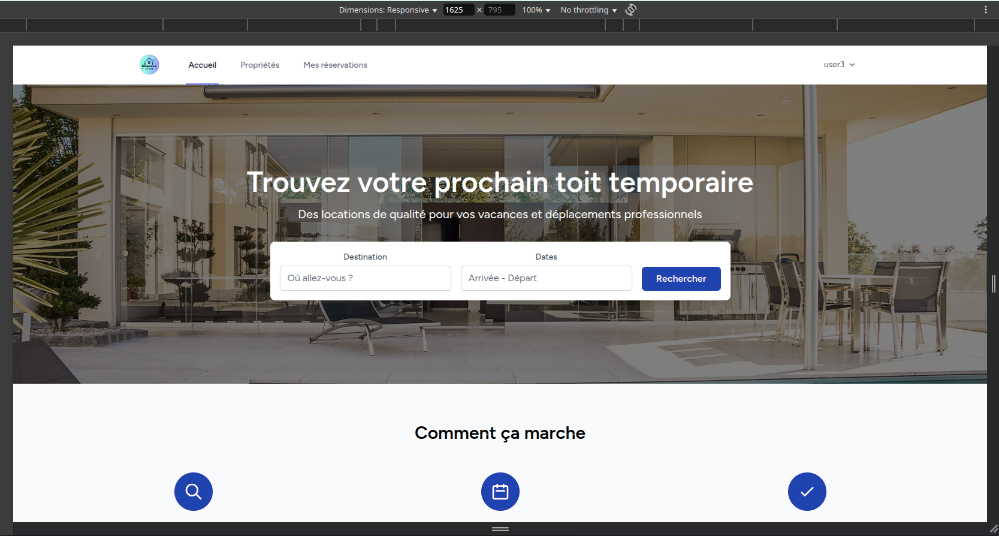

#### Connexion et inscription utilisateur
<div style="display: flex; gap: 10px; flex-wrap: wrap;">
  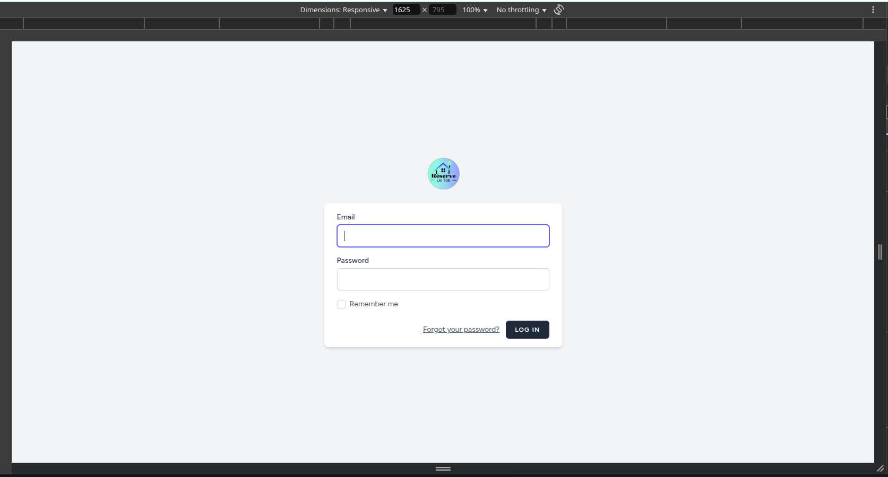
  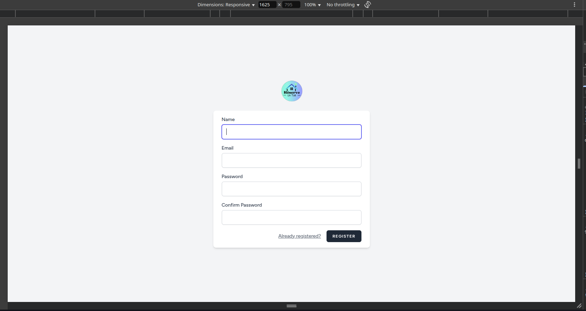
</div>

#### Catalogue de propriétés
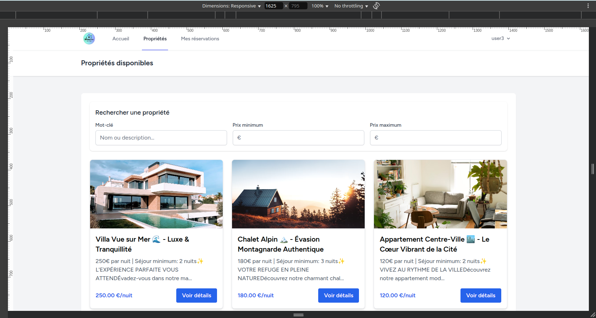

#### Détail d'une propriété
<div style="display: flex; flex-direction: column; gap: 10px;">
  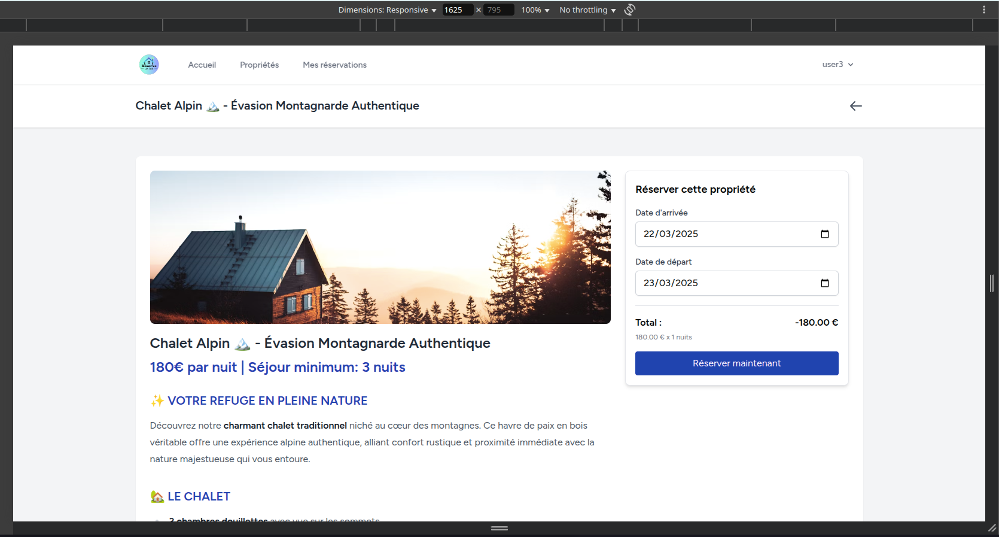
  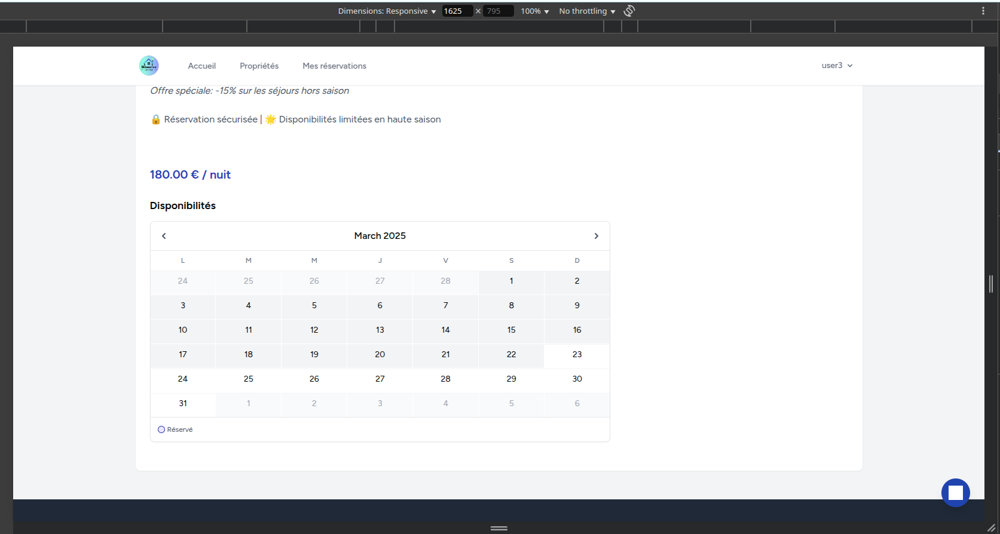
</div>

#### Profil utilisateur
<div style="display: flex; flex-direction: column; gap: 10px;">
  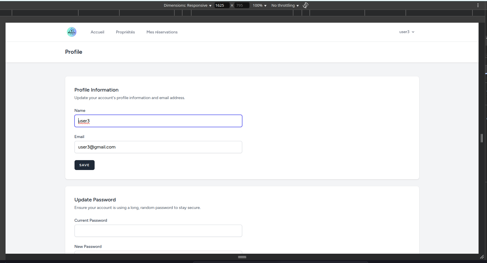
  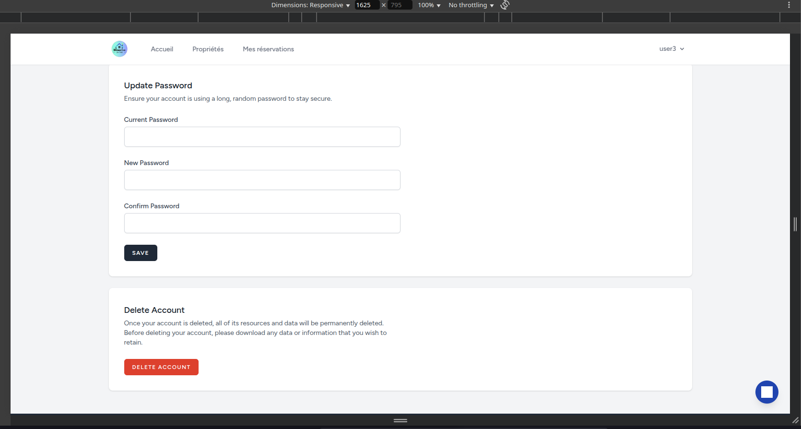
</div>

### Interface d'administration

#### Dashboard et gestion
<div style="display: flex; flex-direction: column; gap: 10px;">
  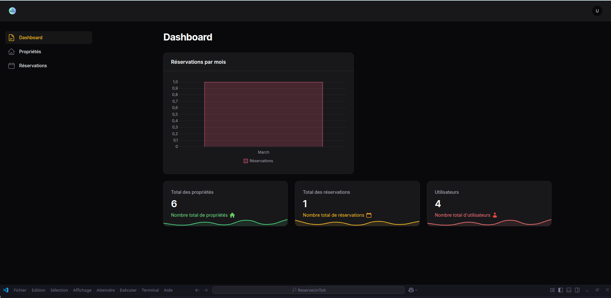
  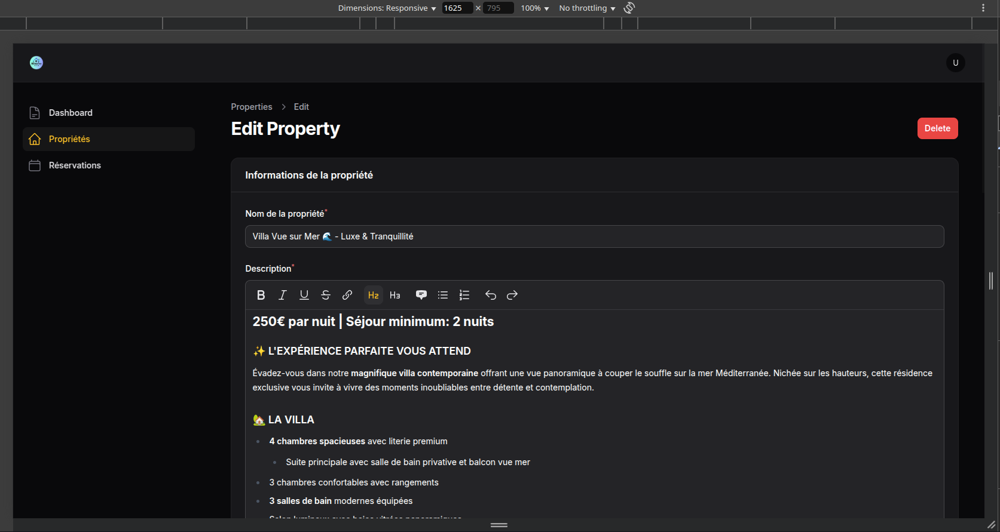
</div>

#### Gestion des propriétés et réservations
<div style="display: flex; flex-direction: column; gap: 10px;">
  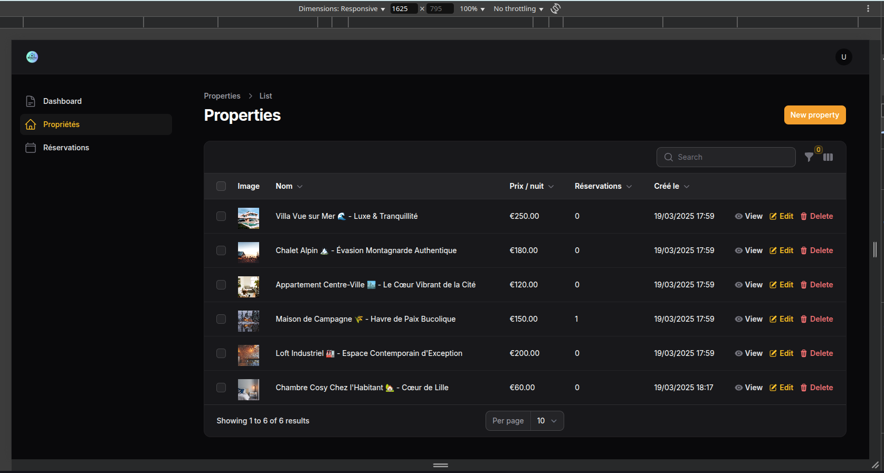
  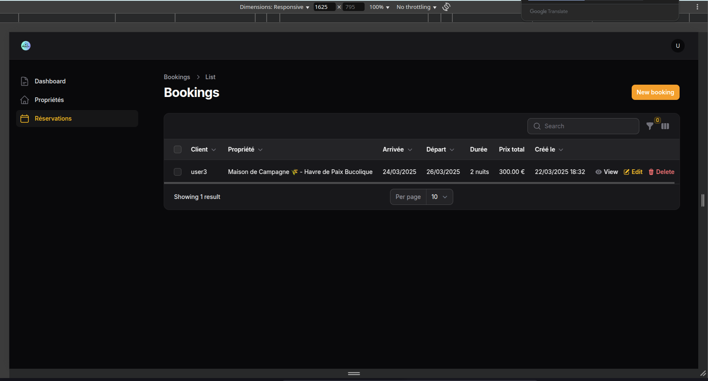
</div>

### Version Mobile

#### Navigation mobile
<div style="display: flex; gap: 10px; flex-wrap: wrap; justify-content: center;">
  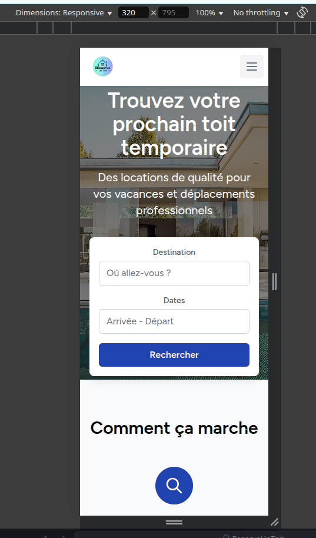
  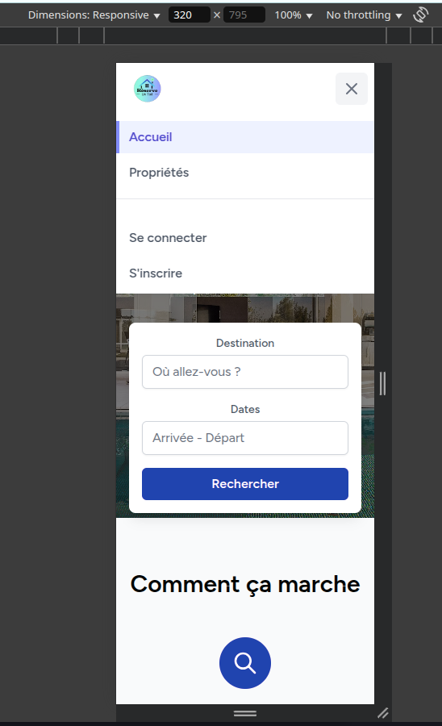
</div>

#### Propriétés sur mobile
<div style="display: flex; justify-content: center;">
  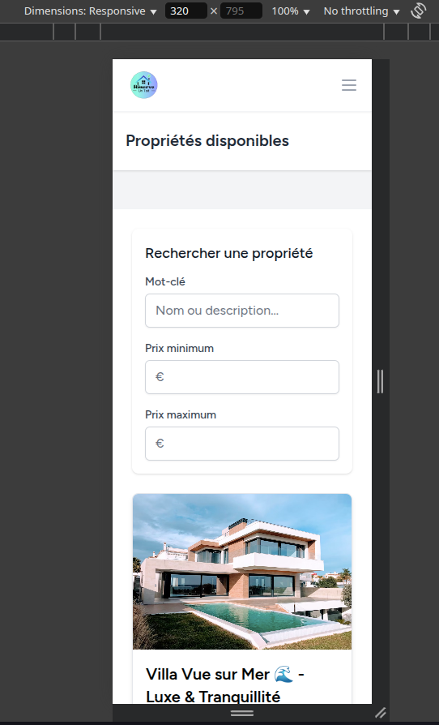
</div>

#### Détail sur mobile
<div style="display: flex; gap: 10px; flex-wrap: wrap; justify-content: center;">
  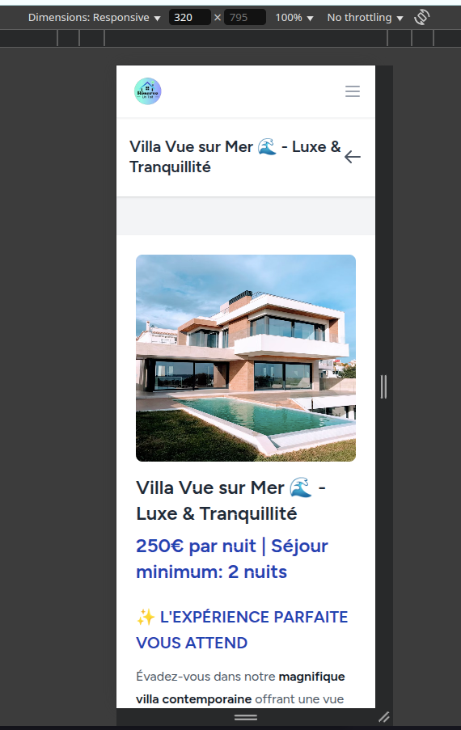
  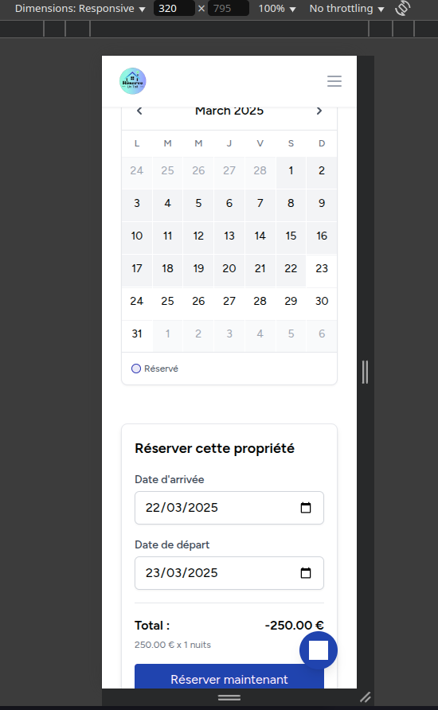
</div>

#### Profil sur mobile
<div style="display: flex; justify-content: center;">
  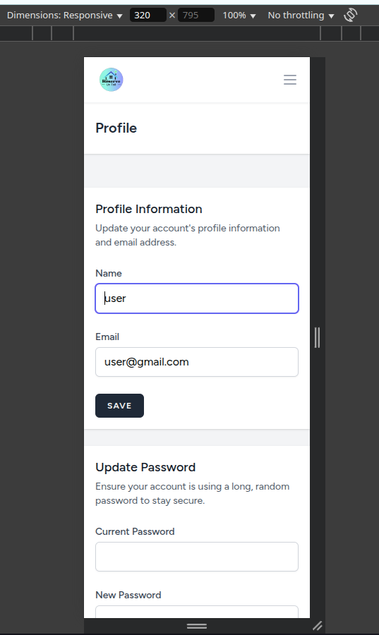
</div>


## 🤝 Contribution

Les contributions sont les bienvenues ! Pour contribuer :

1. Fork le projet
2. Créez votre branche (`git checkout -b feature/AmazingFeature`)
3. Committez vos changements (`git commit -m 'Add some AmazingFeature'`)
4. Push sur la branche (`git push origin feature/AmazingFeature`)
5. Ouvrez une Pull Request

## 📄 Licence

Ce projet est sous licence MIT. Voir le fichier `LICENSE` pour plus d'informations.

---

⭐ **Développé par [Poca23](https://github.com/Poca23)** ⭐

*Pour toute question ou suggestion, n'hésitez pas à ouvrir une issue sur GitHub.*
"